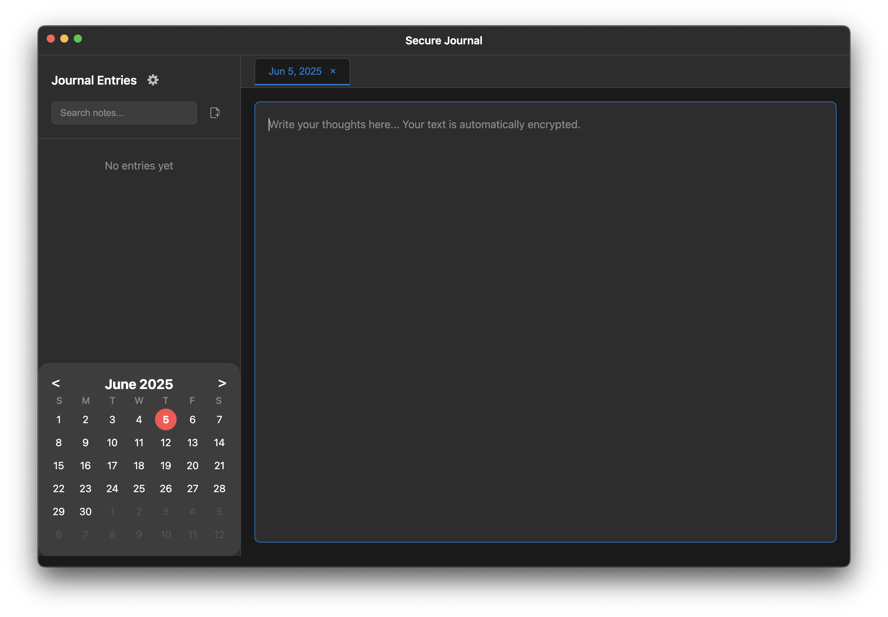

# 🚀 Secure Journal

**A modern, privacy-first, cross-platform journaling app — built with Electron, featuring full data encryption, calendar view, autosave, and more.**



---

## ✨ Features

- **🔒 AES-256 Encryption**: All journal entries are encrypted with industry-standard AES-256 encryption.
- **🛡️ Password Protection**: Strong password authentication with bcrypt hashing.
- **🔐 Secure Storage**: Encrypted files are stored locally with `.enc` extension.
- **🔄 Password Management**: Change your password anytime with automatic re-encryption of all entries.
- **🚫 No Cloud Storage**: Your data never leaves your device.
- **🌙 Dark Mode**: Beautiful dark theme that's easy on the eyes.
- **📱 Clean Interface**: Minimal two-panel layout with entries list on the left and editor on the right.
- **📅 Calendar View & Date-based Organization**: Each journal entry is automatically organized by date; browse entries with a clean, Apple-style calendar.
- **💾 Autosave**: Entries are always saved instantly as you type or switch between dates.
- **🗑️ Delete Protection**: Confirmation dialog before deleting entries.
- **⚠️ Unsaved Changes Warning**: Visual indicators and warnings for unsaved changes.
- **💪 Password Strength Indicator**: Real-time feedback on password security.
- **🖥️ Cross-platform**: Works on **macOS**, **Windows**, and **Linux**.
- **🗃️ Custom Storage Location**: Choose your journal folder, or use the secure default.
- **🧑‍💻 Open Source**: MIT licensed.

---

## 🛠️ Installation

```bash
git clone https://github.com/YOUR-USERNAME/secure-journal.git
cd secure-journal
npm install
npm start
```

---

## First Time Setup

### Creating Your Secure Journal

1. **Launch the app** - Run `npm start`
2. **Create a strong password** - You'll be prompted to create a password for your journal
   - Minimum 8 characters
   - Real-time strength indicator shows password security
   - Include uppercase, lowercase, numbers, and special characters for maximum security
3. **Confirm password** - Re-enter your password to confirm
4. **Start journaling** - Your secure journal is now ready!

### Logging In

- Enter your password to unlock your encrypted journal entries
- Invalid password attempts will be rejected
- Your data remains encrypted until you provide the correct password

---

## Usage

### Creating a New Entry
- Click the "+ New Entry" button in the sidebar
- This will create an entry for today's date
- Start typing in the editor area - your text is automatically encrypted when saved

### Viewing Existing Entries
- All your entries are listed in the left sidebar, sorted by date (newest first)
- Click on any date to view and edit that entry
- Entries are automatically decrypted when loaded

### Saving Entries
- Entries are automatically saved as you type, and when you switch between dates

### Deleting Entries
- Hover over an entry in the sidebar to see the delete button (×)
- Click the delete button and confirm to remove the entry
- Encrypted file is permanently deleted from disk

### Security Settings
- Click "Settings" in the top-right to change your password
- Enter your current password and create a new one
- All existing entries are automatically re-encrypted with the new password
- Password strength indicator helps you create a secure password

### Logging Out
- Click "Logout" to secure your journal
- Any unsaved changes will prompt you to save before logging out
- Journal remains encrypted until you log back in

---

## Data Storage & Security

### Encryption Details
- **Algorithm**: AES-256 encryption (military-grade security)
- **Password Hashing**: bcrypt with salt (industry standard)
- **File Format**: Encrypted entries stored as `.enc` files
- **Key Management**: Encryption key derived from your password

### File Structure

```
journal-app/
├── main.js              # Main Electron process with encryption
├── index.html           # Dark mode UI with authentication
├── renderer.js          # Frontend logic with security features
├── package.json         # Project dependencies
├── data/                # Encrypted journal entries
│   ├── 2024-06-04.enc   # AES-256 encrypted entry
│   ├── 2024-06-03.enc   # AES-256 encrypted entry
│   └── ...
├── config/              # Security configuration
│   └── password.hash    # bcrypt hashed password
└── README.md            # This file
```

### Security Best Practices
- **Choose a strong password** - Use a mix of characters, numbers, and symbols
- **Don't forget your password** - There's no password recovery (by design for security)
- **Regular backups** - Back up your encrypted `.enc` files if desired
- **Secure your device** - Use device encryption and screen locks
- **Log out when away** - Always log out when stepping away from your computer

---

## Dark Mode Theme

The app features a beautiful dark theme designed for comfortable journaling:

- **Primary Background**: `#1a1a1a` (Deep black)
- **Secondary Background**: `#2d2d2d` (Dark gray)
- **Accent Color**: `#007acc` (Blue)
- **Success Color**: `#28a745` (Green)
- **Danger Color**: `#dc3545` (Red)
- **Text Colors**: Various shades of white and gray for optimal contrast

---

## Technical Details

- **Framework**: Electron (cross-platform desktop apps)
- **Encryption**: AES-256 via crypto-js library
- **Password Hashing**: bcrypt with 10 salt rounds
- **Storage**: Local encrypted files (no cloud dependency)
- **UI**: Vanilla HTML/CSS/JavaScript with dark theme
- **IPC**: Secure Inter-Process Communication
- **Dependencies**: crypto-js, bcryptjs, electron

---

## Security Considerations

⚠️ **Important Security Notes**:
- Your password is never stored in plain text
- Entries are only decrypted in memory when viewing
- No password recovery mechanism exists (by design)
- Data never leaves your local device
- App requires authentication on every startup

---

## 📷 Screenshots

[Log-in Screen (Dark Mode)](assets/screenshots/d1.png)
[Main Screen (Dark Mode)](assets/screenshots/d2.png)
[Settings Screen (Dark Mode)](assets/screenshots/d3.png)
[Log-in Screen (Light Mode)](assets/screenshots/w1.png)
[Main Screen (Light Mode)](assets/screenshots/w2.png)
[Settings Screen (Light Mode)](assets/screenshots/w3.png)

---

## 🙏 Contributing

PRs welcome! Please open an issue to discuss improvements or bugs.

---

## ⚖️ License

MIT

---